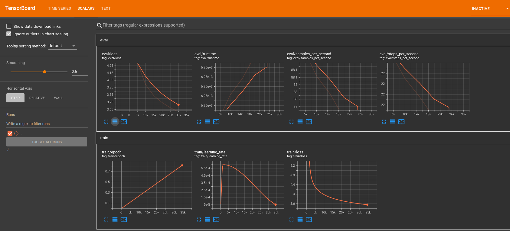

# 大規模言語モデルを自作しよう！(Transformers+DeepSpeed+torch.compile+flash_attn2）

> [!CAUTION]
> 本記事の内容は、2023年12月時点のものです。  
> 最新の内容は、[こちら](https://zenn.dev/selllous/articles/transformers_pretrain_to_ft)を参照してください。  

本記事は、[LLM Advent Calendar 2023](https://qiita.com/advent-calendar/2023/llm) 13日目の記事です。  

https://qiita.com/advent-calendar/2023/llm

## はじめに

[🤗 Transformers](https://huggingface.co/docs/transformers/index)は、自然言語処理、マルチモーダル、音声処理、コンピュータビジョン分野の事前学習済モデルを簡単にダウンロードしトレーニングすることが可能なpythonライブラリです。このライブラリを使用し、大規模言語モデル（LLM）の事前学習済モデルをローカルPC上にダウンロードし、それを使用した言語生成や、要約・翻訳・質問応答などの個別のタスクへのファインチューニング、チャットAIへの組み込みなどが盛んに行われています。

LLMの事前学習方法に関する情報としては、[GPT-NeoX](https://github.com/EleutherAI/gpt-neox)や[Megatron-LM](https://github.com/NVIDIA/Megatron-LM)、[TinyLlama](https://github.com/jzhang38/TinyLlama)、[lit-llama](https://github.com/Lightning-AI/lit-llama)など、他のpythonライブラリを使用したものが増えてきています。一方で、Transformersライブラリを使用したLLMの事前学習に関する情報は未だ少ない現状にあります。  

そこで本記事では、300M規模のMistralモデルを題材とし、Transformersを使用してLLMの事前学習・ファインチューニングを実施する方法を紹介します。本記事で作成できるbaseモデルは[こちらの「japanese-mistral-300m-base」](https://huggingface.co/ce-lery/japanese-mistral-300m-base)、instructionモデルは[こちらの「japanese-mistral-300m-instruction」](https://huggingface.co/ce-lery/japanese-mistral-300m-instruction)に公開しています。

実装のためのソースコードは、[japanese-mistral-300m-recipe](https://github.com/ce-lery/japanese-mistral-300m-recipe)にて[v0.1.0](https://github.com/ce-lery/japanese-mistral-300m-recipe/tree/v0.1.0)として公開しており、本記事の位置づけはその解説です。以下のコマンドを実行することで、環境構築、事前学習、ファインチューニング、推論のすべてが実施可能です。  

```bash
git clone japanese-mistral-300m-recipe
cd japanese-mistral-300m-recipe
git checkout v0.1.0
docker build -t cuda12.1-cudnn8-python3.11.6 ./
docker run -v ./:/home/japanese-gpt2/ -it --gpus all cuda12.1-cudnn8-python3.11.6
bash run_all.sh
```

この記事の特徴は、以下の通りです。  

- SentencePieceトークナイザーでのbyte fallback使用によるunknown_token生成抑制と、huggingface Tokenizers形式への変換
- torch.compileを利用した学習高速化（2倍程度） 
- flash attention2を使用した学習高速化（1.2倍程度）
- DeepSpeed ZEROを用いたRAMオフロードにより、小規模VRAMでの学習にも対応
- Mistral 300Mの利用

> [!TIP]  
> 本記事は、[rinna/japanese-gpt2-medium](https://huggingface.co/rinna/japanese-gpt2-medium)に近しい性能のMistralモデルを作成することを目標にしております。  
> [rinna/japanese-gpt2-medium](https://huggingface.co/rinna/japanese-gpt2-medium)の学習方法は[rinnakk/japanese-pretrained-modelsリポジトリ](https://github.com/rinnakk/japanese-pretrained-models)で公開されており、本記事のスクリプトとは上記の特色と、学習スクリプト・学習用ハイパーパラメータの点で違いがあります。  

> [!TIP]  
> 今回使用するMistral-300Mモデルは、世にある7Bモデルと比較すると、そのモデル規模は1/20程度と小さなものです。Transformersの場合、後からモデルサイズを大きくして学習することは非常に容易であるため、今回はご家庭PCでも学習がしやすい小規模のモデルを使用しました。

## Quick Start with Google Colaboratory

事前学習・ファインチューニングを手っ取り早く試したい方のために、Google Colaboratory上で本記事の簡易的な内容を試せる[ipynbスクリプト](https://colab.research.google.com/github/ce-lery/japanese-mistral-300m-recipe/blob/v0.1.0/quick_start.ipynb)を用意しました。  

[](https://colab.research.google.com/github/ce-lery/japanese-mistral-300m-recipe/blob/v0.1.0/quick_start.ipynb)

@[gist](https://gist.github.com/ce-lery/732030875edb7d008d633b713d89d6f7)

無料枠のT4 GPUを用いて実行可能です。T4でのデータセット構築〜ファインチューニング完了・推論までの時間は**6時間程度**ですので、**コンピューティングユニットの消費にご注意ください。**

以下の手順で実行してください。  

1. 上記の「Open In Colab」ボタンをクリックし、Google Colaboratoryを開く
2. ページ上部のタブから「ランタイム」>「すべてのセルを実行」をクリック

以降の章では、[japanese-mistral-300m-recipeのv0.1.0](https://github.com/ce-lery/japanese-mistral-300m-recipe/tree/v0.1.0)を使用してローカルPCにて事前学習&ファインチューニングを実施する方法を説明します。  

> [!WARNING]
> 本記事内で使用しているDeepSpeedライブラリ、bitsandbytesライブラリは、その機能の一部がWindows OSに対応していません。Windows OSの方は、Google ColaboratoryでこのQuick Startをお試しください。  

## 検証環境

|項目|バージョン|備考|
|:--|:--|:--|
|OS|Ubuntu 22.04.3 LTS||
|CPU|AMD® Ryzen 5 3600x 6-core processor × 12||
|RAM|DDR4 80GB|DDR5の方が学習時間が高速化されるかもしれません（未検証）|
|GPU|RTX4090 VRAM24GB||
|python|3.11.6|pyenv localにて設定|
|CUDA toolkit|12.1|[Dockerfile](https://github.com/ce-lery/japanese-mistral-300m-recipe/blob/v0.1.0/Dockerfile)参照|
|cudnn|8.8.0.121|[Dockerfile](https://github.com/ce-lery/japanese-mistral-300m-recipe/blob/v0.1.0/Dockerfile)参照|
|pythonライブラリ|transformers==4.35.2<br>torch==2.1.1+cu121<br>deepspeed==0.12.3<br>flash_attn==2.3.4|その他は[requirements.txt](https://github.com/ce-lery/japanese-mistral-300m-recipe/blob/v0.1.0/requirements.txt)参照|
|SSD|1.5TB|中間生成ファイル等が作られますが、このサイズがあれば十分です|
|その他ハードディスク|HDD 12TB<br>SSD 4TB||

> [!TIP]
> 学習データ・スクリプトはM.2 NVME SSD上に配置してください。HDD上に配置する場合と比較して、学習速度が10%程度向上します。


## ワークフロー

本記事の実施内容と所要時間は以下の通りです。LLMは、基本的に以下の流れで作成されます。  
所要時間はハードウェア性能に起因して前後します。  

|No.|ステップ|所要時間|
|:--|:--|:--|
|1|[python仮想環境構築](#python仮想環境構築)|10min|
|2|[データセット構築](#データセット構築)|10h|
|3|[トークナイザー学習](#トークナイザー学習)|30min|
|4|[事前学習](#事前学習)|120h|
|5|[評価](#評価)|1.5h|
|6|[推論](#推論)|1min|
|7|[ファインチューニング](#ファインチューニング)|10min|
|8|評価|20min|
|9|[推論2](#推論2)|1min|


## python仮想環境構築

Dockerを使用した環境構築を推奨します。
以下のコマンドを実行することで、CUDAT toolkitとcudnn、その他のツールをインストールしたコンテナが作成されます。

```bash
docker build -t cuda12.1-cudnn8-python3.11.6 ./
```

次に、以下のコマンドでコンテナを起動し、コンテナ上での開発に移ります。  

```bash
docker run -v ./:/home/japanese-gpt2/ -it --gpus all cuda12.1-cudnn8-python3.11.6
```

最後に、以下のコマンドでpython仮想環境を構築します。  

```bash
bash setup.sh
```

setup.sh内では、pyenvによるpythonバージョン指定、venv環境の構築、pythonライブラリのインストールを実施します。  

https://github.com/ce-lery/japanese-mistral-300m-recipe/blob/v0.1.0/setup.sh

> [!TIP]
> 本リポジトリでは、.env（python 3.11.6）と.env_py310（python 3.10.10）という2種類のvenv環境を構築しています。基本的に.envを使用しますが、wikipediaデータの抽出ライブラリ「wikiextractor」がpython 3.10以下にしか対応していないため、データセット作成時に限り.env_py310を使用します。

> [!TIP]
flash_attnはインストールの順番に制約があります。詳細は[こちら](https://github.com/Dao-AILab/flash-attention/issues/453)をご参照ください。

## データセット構築

事前学習用のデータセットは、wikipediaデータセットと、cc100データセットをマージして構築します。  
以下のコマンドを実行することで、データセットの構築が可能です。  

```bash
cd pretrain
bash dataset/dataset.sh
```

### データセットのダウンロード

以下のコードを実行し、wikipediaデータと、cc100データのダウンロード、マージを実施します。  

https://github.com/ce-lery/japanese-mistral-300m-recipe/blob/v0.1.0/pretrain/dataset/dataset.sh

### クリーニング

データのマージ前に、データセットの最低限のクリーニングとして、文章の正規化を実施します。

https://github.com/ce-lery/japanese-mistral-300m-recipe/blob/v0.1.0/pretrain/dataset/dataset.sh#L42-L48

今回は[こちら](https://zenn.dev/schnell/articles/0eba71dc364b7f)で紹介されている[neologdn](https://github.com/ikegami-yukino/neologdn)を使用し、データセットの正規化を実施しました。neologdnの正規化内容は、例えば「半角カタカナは全角に置き換え」「全角スペースは半角スペースに置き換える」などがあります。詳細は以下をご覧ください。  

https://github.com/neologd/mecab-ipadic-neologd/wiki/Regexp.ja

> [!TIP]
>「機械学習（データ分析）は前処理が8割」と言われますが、LLMも例外ではなく、データセットのクリーニングが精度を左右します。  
> クリーニングには、データセットの正規化以外にも、品質フィルタリング、重複排除、文字コードの再フォーマットの作業があります。[rinna/japanese-gpt2-medium](https://huggingface.co/rinna/japanese-gpt2-medium)の[学習スクリプト](https://github.com/rinnakk/japanese-pretrained-models)を見るに、これらの処理は実施されていないように見受けられたため、本記事では割愛します。  

### データセットのtrain-test分割

wikipediaデータとcc100データのそれぞれを、ファイル行数でtrain:test=95:5で分割し、train、testごとにマージしてデータセットとします。  

https://github.com/ce-lery/japanese-mistral-300m-recipe/blob/v0.1.0/pretrain/dataset/dataset.sh#L54-L79

また、トークナイザー学習用に、wikipediaデータとcc100データの全てをマージしたmerge_dataset_for_spm.txtを作成します。  

https://github.com/ce-lery/japanese-mistral-300m-recipe/blob/v0.1.0/pretrain/dataset/dataset.sh#L50-L52

> [!TIP]
>機械学習では、train:testの分割割合は7:3や8:2とし、[交差検証](https://ja.wikipedia.org/wiki/%E4%BA%A4%E5%B7%AE%E6%A4%9C%E8%A8%BC#:~:text=%E3%81%9F%E3%82%81%E3%81%A7%E3%81%82%E3%82%8B%E3%80%82-,k%2D%E5%88%86%E5%89%B2%E4%BA%A4%E5%B7%AE%E6%A4%9C%E8%A8%BC,-%5B%E7%B7%A8%E9%9B%86%5D)を行うのが一般的です。
>今回の分割比率は、run_clm.pyのvalidation_split_percentage(run_clm.py内部でこの値に応じて、自動的にtrain:validationの分割をする)のデフォルト値が5%になっていることを鑑みて、95:5をtrain:testの割合として採用しました。

## トークナイザー学習

TransformersのTransformerモデルは、入力として文字列を受けとることができません。代わりに、文字列をトークンという単位に分割し、トークンごとに割り当てられた数値（ID）を入力値として使用します。トークナイザーは、文字列をトークンに分割し、トークンごとにID変換するものです。  


トークナイザーのトークン分割単位を決定づけるアルゴリズムには、バイトペアエンコーディング（BPE）、WordPiece、Unigramどがあります。各アルゴリズムの詳細は[こちら](https://huggingface.co/docs/transformers/tokenizer_summary#wordpiece)に譲るとして、今回は[SentensePieceライブラリ](https://github.com/google/sentencepiece)にてUnigramアルゴリズムを使用して、トークン分割単位の決定とトークンごとのID割り当てを行います。本資料では、この処理を「トークナイザーの学習」と呼称します。  

トークナイザーの学習は、以下のスクリプトで実行可能です。  

https://github.com/ce-lery/japanese-mistral-300m-recipe/blob/v0.1.0/pretrain/tokenizer/tokenizer.sh

### SentencePiece学習

SentensePieceライブラリを使用し、トークナイザーの学習を実施します。トークナイザーは、wiki+cc100の全データを用いて[Unigramアルゴリズム](https://huggingface.co/docs/transformers/tokenizer_summary#unigram:~:text=u%22%22g%22-,%E3%83%A6%E3%83%8B%E3%82%B0%E3%83%A9%E3%83%A0,-Unigram%20%E3%81%AF%E3%80%81%E3%80%8CSubword)で学習します。  

https://github.com/ce-lery/japanese-mistral-300m-recipe/blob/v0.1.0/pretrain/tokenizer/spm_tokenize.py#L1-L25

SentencePieceトークナイザーは、15行目の「vocab_size=50000」で、トークナイザーのリストに登録する語彙数を設定しています。逆に、この数以上の語彙は登録されません。トークナイザーは、リストに登録されていない文字列は処理することができず、未知語（unknown_token）として処理します。すなわち、リストに登録されていない文字列は、学習時・推論時に[unk]となってしまいます。

これを防ぐための機能がbyte-fallbackです。13行目のようにこれを有効にすることで、SentencePieceトークナイザーは渡されたリスト未登録文字をバイト単位でIDにエンコードすると共に、バイト単位のIDをUTF-8形式でデコードすることが可能になります。つまり、トークナイザーのリストに登録されていない文字列も処理することができます。  


> [!TIP]
> SentencePieceのpythonラッパーの使い方は、[こちら](https://github.com/google/sentencepiece/blob/master/python/sentencepiece_python_module_example.ipynb)がわかりやすいです。

> [!TIP]
> UTF-8の詳しい説明は、[こちら](https://ja.wikipedia.org/wiki/UTF-8)と[こちら](https://orange-factory.com/dnf/utf-8.html)を参照。1〜4バイトの可変長符号化方式ですが、1バイト目の先頭ビットを確認することでその文字が何バイト数のものなのかわかるため、デコードが可能になります。  

### Tokenizers T5Tokenizer形式への変換

Transformersライブラリは、SentencePieceライブラリで生成されたトークナイザーをそのまま使用することができません。Transformersライブラリでも使用できるように、huggingface TokenizersライブラリのT5Tokenizersクラス形式に変換します。

https://github.com/ce-lery/japanese-mistral-300m-recipe/blob/v0.1.0/pretrain/tokenizer/spm_tokenize.py#L45-L55

> [!WARNING]
> 上記コードの"T5Tokenizer"を"PreTrainedTokenizerFast"に変更すると、PreTrainedTokenizerFast形式へ変換できます。一方で、PreTrainedTokenizerFastはSentencePieceのbyte fallbackに対応していないため、decode時にutf-8に変換できない場合があります。
> ```bash
> 明治天皇は大<0xE5><0x98><0x97>宮を主宰した。
> #明治天皇は大嘗宮を主宰した。
> ```
> 今回は、byte fallbackにも対応しているT5Tokenizer形式へ変換しました。 
> なお、未検証ですが、LlamaTokenizerでも動作するかと思います。  

### データセットのトークン化処理

先ほど作成したトークナイザーを使用して、データセット全体をトークン化します。  
この処理は、後述の[run_clm.py](https://github.com/ce-lery/japanese-mistral-300m-recipe/blob/v0.1.0/pretrain/train/run_clm.py)に実装されており、run_clm.py実行時に実施されます。  

https://github.com/ce-lery/japanese-mistral-300m-recipe/blob/v0.1.0/pretrain/train/run_clm.py#L496-L516

## 事前学習

事前学習およびファインチューニングには、Transformersのexampleスクリプトの1つである[run_clm.py](https://github.com/huggingface/transformers/blob/v4.35.2/examples/pytorch/language-modeling/run_clm.py)を使用します。run_clm.pyの一部を、以下のように修正しています。

https://github.com/ce-lery/japanese-mistral-300m-recipe/compare/4a5db3b...v0.1.0#diff-feb09b684439e0d531ee6915271ead1e3be327665a072940d64e538828ec2f85

```diff python
@@ -56,7 +56,7 @@


  # Will error if the minimal version of Transformers is not  installed. Remove at your own risks.
- check_min_version("4.34.0")
+ check_min_version("4.35.0")

  require_version("datasets>=1.8.0", "To fix: pip install -r examples/pytorch/language-modeling/requirements.txt")

@@ -248,12 +248,12 @@ def main():
      # We now keep distinct sets of args, for a cleaner separation of concerns.

      parser = HfArgumentParser((ModelArguments, DataTrainingArguments, TrainingArguments))
-     if len(sys.argv) == 2 and sys.argv[1].endswith(".json"):
-        # If we pass only one argument to the script and it's the path to a json file,
-        # let's parse it to get our arguments.
-        model_args, data_args, training_args = parser.parse_json_file(json_file=os.path.abspath(sys.argv[1]))
-     else:
-        model_args, data_args, training_args = parser.parse_args_into_dataclasses()
+     # if len(sys.argv) == 2 and sys.argv[1].endswith(".json"):
+     #     # If we pass only one argument to the script and it's the path to a json file,
+     #     # let's parse it to get our arguments.
+     model_args, data_args, training_args = parser.parse_json_file(json_file=os.path.abspath(sys.argv[1]))
+     # else:
+     #     model_args, data_args, training_args = parser.parse_args_into_dataclasses()

      if model_args.use_auth_token is not None:
          warnings.warn(
 @@ -437,7 +437,8 @@ def main():
              if model_args.torch_dtype in ["auto", None]
              else getattr(torch, model_args.torch_dtype)
          )
-         model = AutoModelForCausalLM.from_pretrained(
+         from transformers import  MistralForCausalLM, MistralConfig   
+         model = MistralForCausalLM.from_pretrained(
              model_args.model_name_or_path,
              from_tf=bool(".ckpt" in     model_args.model_name_or_path),
              config=config,
 @@ -447,9 +448,31 @@ def main():
              trust_remote_code=model_args.trust_remote_code,
            torch_dtype=torch_dtype,
              low_cpu_mem_usage=model_args.low_cpu_mem_usage,
+             use_flash_attention_2=True
          )
      else:
-         model = AutoModelForCausalLM.from_config(config, trust_remote_code=model_args.trust_remote_code)
+         from transformers import  MistralForCausalLM, MistralConfig   
+         import json
+
+         def load_config_from_json(config_file):
+             with open(config_file, 'r') as f:
+                 config = json.load(f)
+                 config = MistralConfig.from_dict(config)
+             return config
+
+         # model = AutoModelForCausalLM.from_config(config, trust_remote_code=model_args.trust_remote_code)
+         config = load_config_from_json(config_file = os.path.join(os.path.dirname(__file__),"mistral-300m/config.json"))
+         # model = MistralForCausalLM(config)
+         #refer:https://github.com/huggingface/transformers/issues/21610
+         from collections import OrderedDict
+
+         model = MistralForCausalLM.from_pretrained(pretrained_model_name_or_path=None, 
+                                                    config=config, 
+                                                    state_dict=OrderedDict(),
+                                                    use_flash_attention_2=True)
+
+         print("mistral config:",config)
+         print("mistral model architecture:",model)
          n_params = sum({p.data_ptr(): p.numel() for p in model.parameters()}.values())
          logger.info(f"Training new model from scratch - Total size={n_params/2**20:.2f}M params")

 @@ -513,6 +536,7 @@ def tokenize_function(examples):
                  f"({tokenizer.model_max_length}). Using     block_size={tokenizer.model_max_length}."
              )
          block_size = min(data_args.block_size,  tokenizer.model_max_length)
+     print("block_size:",block_size)

      # Main data processing function that will concatenate all texts from our dataset and generate chunks of block_size.
      def group_texts(examples):
 @@ -659,4 +683,4 @@ def _mp_fn(index):


  if __name__ == "__main__":
-     main()
+     main()
```

このrun_clm.pyに対し、以下のhf_config.jsonを渡すことで、TrainingArguments()等のパラメータを設定しています。  

https://github.com/ce-lery/japanese-mistral-300m-recipe/blob/v0.1.0/pretrain/train/hf_config.json

> [!TIP]
> Transformersの事前学習については、[「huggingface NLP Course 因果言語モデルを一から学習」](https://huggingface.co/learn/nlp-course/ja/chapter7/6?fw=pt)が参考になります。

### Mistral 300Mモデルの設定

今回は、[mistralai/Mistral-7B-v0.1のconfig.json](https://huggingface.co/mistralai/Mistral-7B-v0.1/resolve/main/config.json)を改良し、以下のようにモデルサイズが338Mになるように変更します。 各 モデルのパラメータは、[japanese-gpt2-mediumのconfig.json](https://huggingface.co/rinna/japanese-gpt2-medium/blob/main/config.json)、[GPT2Config](https://huggingface.co/docs/transformers/v4.35.2/en/model_doc/gpt2)、[MistralConfig](https://huggingface.co/docs/transformers/v4.35.2/en/model_doc/mistral#:~:text=William%20El%20Sayed.-,mistralconfig,-class%20transformers.MistralConfig)を参照し、設定しています。

https://github.com/ce-lery/japanese-mistral-300m-recipe/blob/v0.1.0/pretrain/train/mistral-300m/config.json

上記のconfig.jsonを読み込み、以下のようにrun_clm.py内でモデル初期化&学習を実施しています。

```python
#refer:https://huggingface.co/learn/nlp-course/ja/chapter7/6?fw=pt
from transformers import AutoModelForCausalLM, MistralForCausalLM, MistralConfig   
import json

def load_config_from_json(config_file):
    with open(config_file, 'r') as f:
        config = json.load(f)
        config = MistralConfig.from_dict(config)
    return config

config = load_config_from_json(config_file = "mistral-300m/config.json")

#refer:https://github.com/huggingface/transformers/issues/21610
from collections import OrderedDict

model = MistralForCausalLM.from_pretrained(pretrained_model_name_or_path=None,
                                           config=config,
                                           state_dict=OrderedDict(),
                                           use_flash_attention_2=True)

# ~Training Argumentsなどの設定説明は省略~
trainer = Trainer(
    model=model,
    tokenizer=tokenizer,
    args=args,
    data_collator=data_collator,
    train_dataset=tokenized_datasets["train"],
    eval_dataset=tokenized_datasets["valid"],
)
```

モデルサイズは、以下の処理を実行することで確認できます。  
```python
model_size = sum(t.numel() for t in model.parameters())
print(f"Mistral size: {model_size/1000**2:.1f}M parameters")
```


> [!TIP]
> Transformersを使用した事前学習方法は、現状、3種類存在します。前述のfrom_pretrained()を使用したもの以外に、MistralForCausalLM()を使用したもの、from_config()を使用したものがあります。  
> 
> ```python
> #refer:https://huggingface.co/learn/nlp-course/ja/chapter7/6?fw=pt
> from transformers import AutoModelForCausalLM, MistralForCausalLM, MistralConfig   
> import json
> 
> # load_config_from_jsonは前述のものと同じものを使用
> config = load_config_from_json(config_file = "mistral-300m/config.json")    
> model = MistralForCausalLM(config)
> 
> # ~Training Argumentsなどの設定説明は省略~
> trainer = Trainer(
>     model=model,
>     tokenizer=tokenizer,
>     args=args,
>     data_collator=data_collator,
>     train_dataset=tokenized_datasets["train"],
>     eval_dataset=tokenized_datasets["valid"],
> )
> ```
> 
> ```python
> #refer:https://huggingface.co/learn/nlp-course/ja/chapter7/6?fw=pt
> from transformers import AutoModelForCausalLM, MistralForCausalLM, MistralConfig   
> import json
> 
> config = load_config_from_json(config_file = "mistral-300m/config.json")    
> model = MistralForCausalLM._from_config(config)
> 
> # ~Training Argumentsなどの設定説明は省略~
> trainer = Trainer(
>     model=model,
>     tokenizer=tokenizer,
>     args=args,
>     data_collator=data_collator,
>     train_dataset=tokenized_datasets["train"],
>     eval_dataset=tokenized_datasets["valid"],
> )
> ```
> 
> これらのうち、flash_attn2が有効になるのは[modeling_utils.pyの_check_and_enable_flash_attn_2()](https://github.com/huggingface/transformers/blob/514de24abfd4416aeba6a6455ad5920f57f3567d/src/transformers/modeling_utils.py#L3232)関数を実行するfrom_pretrainedのみです。  

### 学習速度高速化

学習時に課題となる要素の1つとして、「学習速度」が挙げられます。例えば学習時間が3600時間（150日）である場合、実質学習できないことと同義です。また、学習時間を短縮することで、GPUの電気料金やGoogle Colabo等の課金料金を削減することができるため、可能な限り学習速度を高速化することが望まれます。  

学習速度の高速化方法は、[こちら](https://huggingface.co/docs/transformers/v4.35.2/en/perf_train_gpu_one)が参考になります。これらのうち、以下の設定を実施します。  

|設定項目|内容|備考|
|:--|:--|:--|
|[fp16の混合精度トレーニング](https://huggingface.co/docs/transformers/v4.35.2/en/perf_train_gpu_one#mixed-precision-training:~:text=%E3%81%8F%E3%81%AA%E3%82%8A%E3%81%BE%E3%81%99%E3%80%82-,%E6%B7%B7%E5%90%88%E7%B2%BE%E5%BA%A6%E3%83%88%E3%83%AC%E3%83%BC%E3%83%8B%E3%83%B3%E3%82%B0,-%E6%B7%B7%E5%90%88%E7%B2%BE%E5%BA%A6%E3%83%88%E3%83%AC%E3%83%BC%E3%83%8B%E3%83%B3%E3%82%B0)|モデルパラメータの一部をfp16精度で表現し、残りはfp32精度とすることで、計算を高速化する|[こちら](https://huggingface.co/docs/transformers/v4.35.2/en/perf_train_gpu_one#fp16:~:text=%E3%83%A2%E3%83%87%E3%83%AB%E3%81%8C%2016%20%E3%83%93%E3%83%83%E3%83%88%E3%81%A8%2032%20%E3%83%93%E3%83%83%E3%83%88%E3%81%AE%E4%B8%A1%E6%96%B9%E3%81%AE%E7%B2%BE%E5%BA%A6%20(GPU%20%E4%B8%8A%E3%81%AE%E5%85%83%E3%81%AE%E3%83%A2%E3%83%87%E3%83%AB%E3%81%AE%201.5%20%E5%80%8D)%20%E3%81%A7%20GPU%20%E4%B8%8A%E3%81%AB%E5%AD%98%E5%9C%A8%E3%81%99%E3%82%8B)の通り、モデルが16ビットと32ビットの両方の精度 (GPU 上の元のモデルの1.5倍)でGPU上に存在するため、多くのGPUメモリが使用される可能性がある|
|[torch.compile](https://huggingface.co/docs/transformers/v4.35.2/en/perf_train_gpu_one#using-torchcompile:~:text=%E3%81%A6%E3%81%8F%E3%81%A0%E3%81%95%E3%81%84%E3%80%82-,torch.compile%20%E3%81%AE%E4%BD%BF%E7%94%A8,-PyTorch%202.0%20%E3%81%A7%E3%81%AF)|PyTorch コードを最適化されたカーネルにJITコンパイルすることで、Pytorch処理時の高速化を実現する|[こちら](https://pytorch.org/tutorials/intermediate/torch_compile_tutorial.html)と[こちら](https://pytorch.org/get-started/pytorch-2.0/#technology-overview)も参照|
|[flash attention2](https://huggingface.co/docs/transformers/v4.35.2/en/perf_train_gpu_one#flash-attention-2)|attention機構の計算を、並列化とWork Partitioningにより効率的に実施する[flash attention](https://github.com/Dao-AILab/flash-attention?tab=readme-ov-file#installation-and-features)に置き換える|現状は、[Ampere、Ada、またはHopper GPU (A100、RTX3090、RTX4090、H100 など)](https://github.com/Dao-AILab/flash-attention?tab=readme-ov-file#installation-and-features:~:text=FlashAttention%2D2%20%E3%81%AF%E7%8F%BE%E5%9C%A8%E4%BB%A5%E4%B8%8B%E3%82%92%E3%82%B5%E3%83%9D%E3%83%BC%E3%83%88%E3%81%97%E3%81%A6%E3%81%84%E3%81%BE%E3%81%99%E3%80%82)のみ対応。T4では使用できない。|

これらの有効化方法は、以下の通りです。

```python
# flash_attention_2の有効化
model = MistralForCausalLM.from_pretrained(pretrained_model_name_or_path=None,
                                           config=config,
                                           state_dict=OrderedDict(),
                                           use_flash_attention_2=True)

# fp16混合精度使用とtorch_compile使用の有効化
training_args = TrainingArguments(..., 
                                  fp16=True,
                                  torch_compile=True)
trainer = Trainer(...)
trainer.train()
```

比較として、torch.comileとflash_attn2を共に無効にした場合の学習時間は236時間、共に有効にした場合は98時間でした。これらの機能を有効にすることで、学習速度が2.4倍になることがわかります。  

> [!CAUTION]
>Transformers v4.35.2では、torch.compileとgradient_checkpointingの併用はできません。torch.compileを使用する場合は、gradient_checkpointing=Falseとしてください。  

### VRAM確保

学習時に課題となるもう1つの要素として、「GPU VRAM容量」が挙げられます。VRAM容量が不足する場合、そもそも学習ができません。  

VRAM容量の不足に対しては、[DeepSpeed ZeRO](https://www.deepspeed.ai/tutorials/zero/)が有効です。これは、複数のGPUおよびCPUに対してさまざまなモデルトレーニング状態 (重み、勾配、オプティマイザー)を分割することでGPU VRAMの消費を削減する機能です。  

以下のコマンドでrun_clm.pyを実行することで、学習に必要なVRAM容量を削減しつつ、高速に学習することを可能としています。  

```bash
deepspeed --no_local_rank run_clm.py hf_config.json --deepspeed_config ds_config_zero.json
```

> [!TIP]
> torch.compileとDeepSpeed ZEROについては、[こちら](https://huggingface.co/docs/transformers/main_classes/deepspeed#passing-configuration:~:text=passed%20to%20it.-,Passing%20Configuration,-As%20discussed%20in)に記載の通り、TrainingArgumentsに対して以下のように引数を渡すことで有効化できます。

```python
training_args = TrainingArguments(..., deepspeed="ds_config_zero.json",torch_compile=True)
trainer = Trainer(...)
trainer.train()
```

しかし、本記事のTransformersバージョンの場合、上記方法でDeepSpeedとtorch.compileの両者を有効化した場合、torch.compileが実行されないという不具合が存在します。  

そもそも、[こちら](https://www.deepspeed.ai/getting-started/)によると、DeepSpeedは以下のように実行可能です。

```bash
deepspeed train.py --deepspeed --deepspeed_config=ds_config_zero.json
```
このことを利用し、今回はTrainingArgumentsの引数としてDeepSpeedは設定せずにtorch.compile=Trueのみを設定し、DeepSpeedは以下の方法で有効化しました。

```bash
deepspeed --no_local_rank run_clm.py hf_config.json --deepspeed --deepspeed_config ds_config_zero.json 
```

この方法であれば、DeepSpeedとtorch.compileの両方が有効になります。
DeepSpeedとTransformersの併用については、[こちら](https://huggingface.co/docs/transformers/main_classes/deepspeed)をご参照ください。
:::

> [!WARNING]
> 現在のhf_config.json設定とdeepspeed_config.json設定は、RTX4090環境向けです。そのため、RTX3060などのVRAMの小さいGPUで学習を回す場合、CUDA OUT OF MEMORY（OOM）エラーが発生します。  
>
> OOMを回避するためにソフトウェア側でできる対策として、「バッチサイズを小さくする」「VRAMに乗せる重みの一部をCPU RAMにオフロードする（DeepSpeed ZERO2、ZERO3）」という方法が存在します。もし小さなVRAMで学習を回す場合は、以下の対策を実施してください。  
> - per_device_train_batch_sizeとper_device_eval_batch_sizeを減らしてgradient_accumulation_stepsを増やす（per_device_train_bath_size*gradient_accumulation_steps=256としてください）
> - 以下のようにds_config_zero2.jsonかds_config_zero3.jsonを使用してRAMオフロード量を増やす（[参考](https://huggingface.co/docs/transformers/v4.35.2/en/main_classes/deepspeed#zero)）  
>   ```markdown
>   deepspeed --no_local_rank run_clm.py hf_config.json --deepspeed --deepspeed_config ds_config_zero2.json
>   ```
> 
> なお、RAMオフロード量と学習速度は、RAMオフロード量を増やすと学習速度が低下するというトレードオフの関係にあります。DeepSpeed ZeroのStage選定方法は[こちら](https://huggingface.co/docs/transformers/v4.35.2/en/main_classes/deepspeed#how-to-choose-which-zero-stage-and-offloads-to-use-for-best-performance)をご参照ください。

### 学習時の進捗状況確認

Transformersでは、以下の手順を踏むことで、学習時のtrain_loss、eval_lossなどをダッシュボード表示する機能が存在します。  

1. 以下のコマンドで、python仮想環境にtensorboardライブラリをインストールする  
   ```bash
   pip install tensorboard
   ```
2. TrianingArgumentsのlogging_dirにログ出力ディレクトリ（例：checkpoints-mistral-300M-FA2/logs）を設定し、学習を開始する
3. 別のterminalを開き、python仮想環境をactivateした状態で以下のコマンドを実行する
    ```bash
   tensorboard --logdir ./
   ```
4. ブラウザで「http://localhost:6006/ 」を開く

以下は、epoch 0.82時の分析結果の様子です。train_loss、eval_lossともに順調に下がっている様子が確認できます。また、learning_rateのWarmupとDecayが効いていることが確認できます。  



> [!TIP]
> この図を見るに、train_lossとeval_lossが横ばいになっておらずまだ下がる傾向にあるため、さらにepoch数を増やすことで改善できる可能性があります。

## 評価

run_clm.pyは以下のように、学習終了後に自動でperplexityを算出します。  
perplexityは35.1016でした。  

```bash
***** eval metrics *****
  epoch                   =        1.0
  eval_loss               =     3.5582
  eval_runtime            = 1:44:34.83
  eval_samples            =     551057
  eval_samples_per_second =      87.82
  eval_steps_per_second   =     21.955
  perplexity              =    35.1016
```

> [!TIP]
>[rinna/japanese-gpt2-medium](https://huggingface.co/rinna/japanese-gpt2-medium)では、[Model summary](https://github.com/rinnakk/japanese-pretrained-models#model-summary)によると、160000steps後のperplexityは18でした。testデータが同一ではないため単純な値の比較はできず、あくまで参考値です。  
>perplexityについては、さらにepoch数を増やして学習することで改善する可能性があります。  

ここまでの手順で、以下の「japanese-mistral-300m-base」が完成します。

https://huggingface.co/ce-lery/japanese-mistral-300m-base

## 推論

推論用ソースコードは以下の通りです。  

https://github.com/ce-lery/japanese-mistral-300m-recipe/blob/v0.1.0/pretrain/inference/inference.py

入力プロンプトを「大規模言語モデルとは、」とした時の、出力結果の一例は以下の通りです。今回は256文字の制限（max_new_tokens=256）を加えていますが、1024 tokenまで出力可能です。  

```bash
大規模言語モデルとは、言語仕様の異なる複数の言語の集合である。  言語は、各言語ごとに異なる言語体系を持つが、その言語がどの言語で記述されているかは必ずしも明確ではない(例:C言語、C++、Perl、Python、Ruby、PHP、Java、Swift、Objective-C、D言語など)。ただし、これらの言語では、必ずしも言語を記述できるとは限らない。また、すべての言語には、特定の言語特有の言語特性がある。例えば、日本語、英語、フランス語、ドイツ語、イタリア語、スペイン語、ポルトガル語、トルコ語、アラビア語、ヘブライ語など、他の言語とは異なる言語によって記述されている言語もある。たとえば、ラテン文字とラテン文字を区別する言語として、アルメニア語や、スロバキア語などがある。しかし、これらは、いずれも言語の特徴を特徴づける言語ではない。そのため、多くの言語に共通した言語構造を持つ言語は存在しない。言語学の分野は多岐にわたるため、それぞれの言語の特性を理解した上で言語設計を行う必要がある。したがって、一つの言語(言語)で言語の構造を記述する言語としては、いくつかの言語が挙げられる。さらに、ある言語において、それぞれ独自の言語が存在する。それらは、文法、語法、語彙、構文、文理、構造、意味、規則、および規則などを含む言語
```

```bash
大規模言語モデルとは、どのようなものなのか。  また、その言語がどのように進化してきたのか、そしてどのように進化していったのかについて、さまざまな視点から解説する。...  [Read more...]  »「言語学入門」第3回「なぜ、言語が進化したのか?」[第2回] (2017年12月3日)  (C) 2018 SQUARE ENIX CO., LTD. [JP/JP];東京都港区南青山5丁目3番3号2-1, Shinjuku University of Tokyo, LLC. ALL RIGHTS RESERVED.〒150-0003東京都渋谷区神宮前6丁目5番1号(GoogleMapsで見る) (Google Mapsで開く) [P], [M]、[F]の順にクリックし、図3に示すように[B]と[C]にカーソルを合わせ、【C】を押下する(B)をドラッグして[D]キーを押す(D)と,[E]キーを押すと,図4のようになる([R]は[H]).[V]を押す(A),または[S]を押しながら[G]を押して[L]を押すと
```

> [!CAUTION]
> 「[Read more...]」や「(GoogleMapsで見る) 」のように、出力結果にノイズが混じってしまっています。epoch数を増やしてlossをさらに減少させつつ、CC100のデータセットのクリーニングを実施する必要があります。

## ファインチューニング

事前学習で作成されたcheckpoints-mistral-300M-FA2モデルをベースに、[databricks-dolly-15k-ja](https://huggingface.co/datasets/kunishou/databricks-dolly-15k-ja)を用いてinstructionチューニングを実施します。  

データセットの形式は、以下のように[alpaca](https://github.com/tatsu-lab/stanford_alpaca)と同様のものとしています。

```bash
<s>
以下は、タスクを説明する指示と、文脈のある入力の組み合わせです。要求を適切に満たす応答を書きなさい。
[SEP]
指示:
あなたは何でも正確に答えられるAIです。
[SEP]
入力:
User:日本で一番高い山は?
[SEP]
応答:
富士山
</s>
```

fine-tuning/dataset/dataset.shを実行することで、以下の手順で学習データセットの整形を実施します。  

1. 「[databricks-dolly-15k-ja](https://huggingface.co/datasets/kunishou/databricks-dolly-15k-ja)」のdatabricks-dolly-15k-ja.jsonをダウンロードする
2. alpaca_preprocess.pyを実行し、databricks-dolly-15k-jaを前述のalpacaフォーマット形式のtxtデータ（databricks-dolly-15k-ja.txt）に変換する

また、fine-tuning/train/train.shを実行することで、databricks-dolly-15k-ja.txtを元にしたファインチューニングを実施します。前述の事前学習と同様にrun_clm.pyを使用して、ファインチューニングも実施しています。  

https://github.com/ce-lery/japanese-mistral-300m-recipe/blob/v0.1.0/fine-tuning/train/train.sh

run_clm.pyには、以下のhf_config_ft.jsonを渡しています。事前学習時のhf_config.jsonとの大きな違いは、model_name_or_pathに対して事前学習済みモデルを設定している点と、validation_split_percentageを10%に設定することで、train_fileから10%をeval用データ・セットとして使用している点です。

https://github.com/ce-lery/japanese-mistral-300m-recipe/blob/v0.1.0/fine-tuning/train/hf_config_ft.json

ここまでの手順で、以下の「japanese-mistral-300m-instruction」が完成します。

https://huggingface.co/ce-lery/japanese-mistral-300m-instruction


## 推論2

ファインチューニングで生成されたモデルを使用し、推論を実行します。  
推論用のコードは以下の通りです。  

https://github.com/ce-lery/japanese-mistral-300m-recipe/blob/v0.1.0/fine-tuning/inference/inference.py

推論結果は、以下の通りです。  

```bash
Assistant:エベレスト山(標高3,929m)は、インドで最も高い山である。標高2,530mの山で、世界で最も高い山であり、世界第3位である[1][2][3][4]。 また、インドの最高峰である[2][4][5]。
Assistant:中国は、世界で最も人口の多い国の一つです。中国の人口は、世界第2位の人口を誇り、世界の人口の約3分の1を占めています。また、人口密度は世界最高で、世界で6番目に人口が多い国でもあります。中国には、中国最大の都市があり、
Assistant:世界で最も高い山の1つで、世界第2位の山である。標高は2,620mで世界最高地点であり、世界で2番目に高い。また、地球上で最も低い山であり[1]、世界で最も標高の高い山でもある[2][3][4][5][6][7]
Assistant:地球上で最も広い大陸はインドで、2番目に大きな国です
eedenは、インドで最も人口の多い国の一つです。インド最大の都市であり、世界で最も人口密度の高い都市の一つでもあります。また、インドの人口の約4分の1が住んでおり、世界第
Assistant:私は、AIが人間を判別できるAIであると考えています。AIは、人間の感情や行動のパターンを学習し、人間とAIを区別する能力を持っています。また、感情分析、言語理解、記憶、学習など、さまざまな能力も持っています。しかし、これらの
```

> [!CAUTION]  
> 理想的な回答は以下のとおりです。事前学習の精度が足りないこともあり、だいぶアホの子になっています。  
> 
> ```bash
> Assistant:富士山
> Assistant:琵琶湖です。
> Assistant:エベレスト
> Assistant:南米大陸にあるチリのパタゴニア湖です。
> Assistant:何でも正確に答えられるAIです。
> ```

## おわりに

本記事では、[japanese-mistral-300m-recipe](https://github.com/ce-lery/japanese-mistral-300m-recipe)を使用し、LLMの事前学習とファインチューニングの方法について説明しました。  

学習自体は回ったものの、最終perplexityが低く、出力結果にURLやwebページのフッターのような文字が混じっているなど、いくつか課題が見られました。今後の展望は以下の通りです。

- [ ] T5TokenizerではなくLlamaTokenizerを使用して学習する
- [ ] データセットのクリーニング（重複排除、品質フィルタリング）
- [ ] lrのスケジューラをconstantに変更&epoch増やして学習
- [ ] 学習時間のさらなる高速化(numbaなどを使用したJITコンパイル、Mixture of Expertsの利用)
- [ ] llm-evaluation-harnessを使用した評価

本記事に関するご意見・改善点等がありましたら、是非コメント欄へ記載をお願いいたします。特に、学習時間の高速化についての情報を必要としております。[japanese-mistral-300m-recipe](https://github.com/ce-lery/japanese-mistral-300m-recipe)へのissue、pull requestも歓迎します。  
また、よろしければ本記事へのいいねをお願いいたします。著者の励みになります。 

最後に、本記事内でリンクしている情報をご提供いただきました皆様に、心より感謝申し上げます。  
